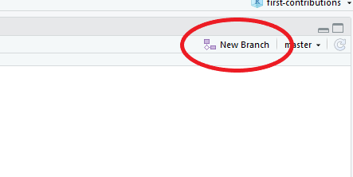
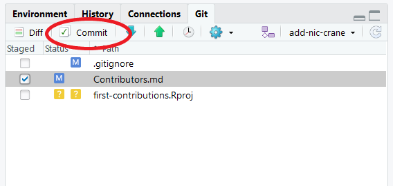
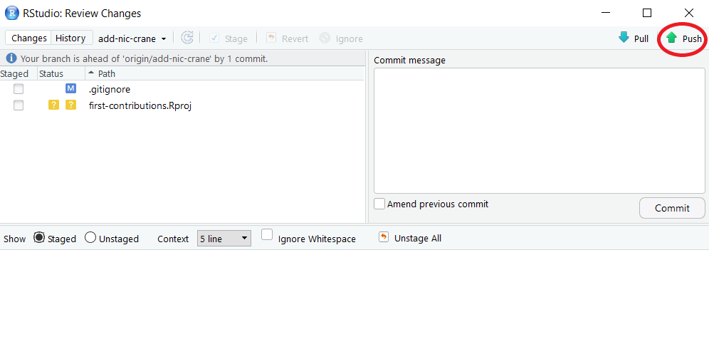

# Primo Contributo

Questo repository è una versione ridotta, ridotta e personalizzata per
RStudio di Amazing [Primo
Contributo](https://github.com/firstcontributions/first-contributions)
repository (e non è ufficialmente affiliato con RStudio). Controlla il
repository originale per istruzioni sull'utilizzo di altri strumenti e
traduzioni in lingua.

## Introduzione

È difficile. È sempre difficile, quando fai qualcosa per la prima volta.
Soprattutto quando si collabora, commettere errori non è una cosa
comoda. Ma l'open source è tutto incentrato sulla collaborazione e sul
lavoro insieme. Volevamo semplificare il modo in cui i nuovi
contributori open source apprendono e contribuiscono per la prima volta.

Leggere articoli e guardare tutorial può aiutare, ma cosa c'è di meglio
che fare effettivamente le cose senza rovinare nulla. Questo progetto
mira a fornire una guida e a semplificare il modo in cui i principianti
danno il loro primo contributo. Ricorda che più sei rilassato e meglio
impari. Se stai cercando di dare il tuo primo contributo, segui i
semplici passaggi seguenti. Ti promettiamo che sarà divertente.

## Cosa ti insegnerà questo

-   come eseguire il fork di un repository
-   come fare un ramo
-   Come inviare una richiesta pull al repository originale

## Cosa questo non ti insegnerà

-   come costruire pacchetti R
-   Etichetta open source

## Presupposti

Ho fatto una serie di presupposti nello scrivere questa guida:

-   hai un account GitHub
-   hai installato
    [RStudio](https://www.rstudio.com/products/rstudio/download/#download)
-   hai installato [git](https://git-scm.com/downloads)

Se vuoi migliorare le tue conoscenze, ti consiglio di lavorare ['Happy
Git and GitHub for the useR'](http://happygitwithr.com/) prima.

## fork di questo repository!

Effettua il fork di questo repository facendo clic sul pulsante fork
nella parte superiore di questa pagina.

## Crea un nuovo progetto

In RStudio, vai su File -\> Nuovo progetto

Seleziona "Controllo versione" e poi "Git".

Nella finestra di dialogo Nuovo progetto, incolla l'URL che hai copiato
da GitHub nella casella "URL del repository".

Scegli il nome con cui vuoi che venga chiamata la directory sul tuo
computer e inseriscilo nella casella "Nome della directory del
progetto". Per impostazione predefinita, questo è il nome del
repository.

Infine, scegli dove desideri archiviare il repository clonato facendo
clic sul pulsante "Sfoglia".

Al termine, fai clic su "Crea progetto" per clonare il repository e
configurare il progetto.

## Crea un ramo

Nella scheda "Git" nel pannello in alto a destra, fai clic sul pulsante
"nuovo ramo".

 

 

Assegna un nome al tuo ramo "aggiungi il tuo nome"

 

Assicurati che "Sincronizza ramo con telecomando" sia selezionato e fai
clic su "Crea". Ti potrebbe essere chiesto di inserire il tuo nome
utente e password GitHub.

## Apporta le modifiche necessarie e salvale

Ora apri il file `Contributors.md` in RStudio e aggiungi il tuo nome,
quindi salva il file.

Vedrai che il file ha una "M" accanto ad esso. Seleziona la casella
accanto ad essa e quindi fai clic su "Commit".

 

Vedrai un file diff che mostra le modifiche che hai apportato al file.
Aggiungi un messaggio di commit: un riepilogo delle modifiche che hai
apportato, quindi fai clic su "Commit". Apparirà una finestra per
confermare il commit; clicca su "chiudi".

 

## Invia le modifiche a GitHub

Congratulazioni, hai eseguito il commit di tutte le modifiche alla tua
copia locale del tuo ramo del tuo fork dei primi contributi. Ora fai
clic su "Push" per sincronizzare il tuo commit con il repository remoto.

 

Vedrai una casella come questa se le modifiche sono state inviate
correttamente. Fare clic su "Chiudi".

 

## Invia le modifiche per la revisione

Se vai al tuo repository su github, vedrai un pulsante "Confronta ed
esegui richiesta". Fare clic su quel pulsante.

 

Assicurati di confrontare i fork. A sinistra dovrebbe esserci il ramo
principale del repository originale e a destra dovrebbe esserci il nuovo
ramo che hai creato nel tuo repository. Dopo aver selezionato le opzioni
corrette e aver scritto un rapido riepilogo delle modifiche apportate,
invia la richiesta pull facendo clic su "Crea richiesta pull".

 

Presto unirò tutte le tue modifiche nel ramo principale di questo
progetto. Riceverai un'e-mail di notifica una volta unite le modifiche!

Congratulazioni! Hai appena completato il flusso di lavoro standard
_fork -\> clone -\> modifica -\> PR_ che incontrerai spesso come
collaboratore!
