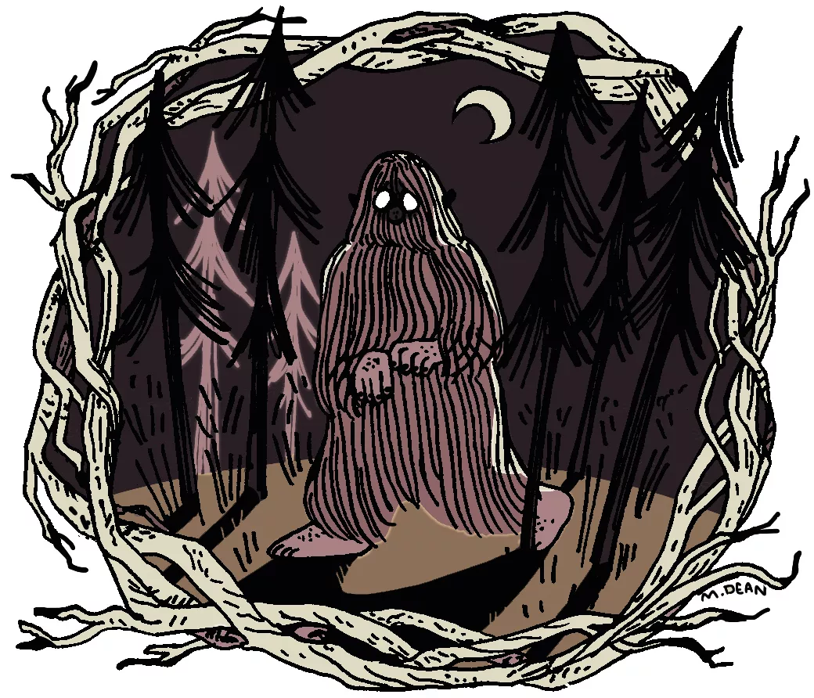

<!--
Comments in HTML are like this! 
-->
```{r, echo=FALSE, message=FALSE, warning=FALSE}
# Set R Markdown chunk defaults:
knitr::opts_chunk$set(
  echo = FALSE, message = FALSE, warning = FALSE, 
  fig.width = 16/2, fig.height = 9/2
)
```
```{r}
# Load all necessary packages here. 
library(tidyverse)
library(leaflet)
library(sf)
library(htmltools)
library(readr)
library(maps)
# Load in datasets
bigfoot_times <- read_csv("~/final_project/bfro_report_locations.csv")
sighting_details <- read_csv("~/final_project/bfro_reports_geocoded.csv")
#Select for the data we need
bigfoot_times <- bigfoot_times %>% select(number, timestamp, classification)
sighting_details <- sighting_details %>% select(-observed,-location_details, -county, - classification, -title)
#Join the datasets based on the "number" labelling them, only include sightings with complete data
bigfoot_data <- inner_join(bigfoot_times, sighting_details, by = "number")
#Filter for only the "Class A" sightings, firsthand views
bigfoot_data <- filter(bigfoot_data, classification == "Class A")
```

{ width=400px }

# The Big(foot) Question
The legend of bigfoot has transcended time, culture, language and nation. It goes by many names, has been described in many different ways, and yet, has remained an elusive entity. Many question his very existence, with a majority of scientists coming to the conclusion that this beast is mere folklore. But despite the many naysayers, there are still firm believers of the Sasquatch to this day. So the question still stands: is Bigfoot real? We explore this question below with data of bigfoot sightings gathered from the BFRO (The Bigfoot Field Research Organization), uploaded by Timothy Renner ^[“Tim Renner's Datasets.” Data.world, 19 Sept. 2018, data.world/timothyrenner.].
```{r}
bigfootIcon <- makeIcon (iconUrl = "https://i.pinimg.com/originals/53/0a/89/530a8916172da685a6859b491ae20b19.png",
  iconWidth = 16, iconHeight = 40,
  iconAnchorX = 0, iconAnchorY = 0)
leaflet(data= bigfoot_data) %>%
 addTiles() %>% 
 addMarkers(~longitude, ~latitude, icon= bigfootIcon)
```

# He's Everywhere

Above is an interactive map showing bigfoot sightings across the US and Canada. There are over 4,500 entries with all sightings included, so we narrowed down this visualization to only class A sightings. Class A sightings, according to to the BFRO, are classified as a sighting where misidentification of other animals can be confidently ruled out ^[Bigfoot Field Researchers Organization, BFRO, www.bfro.net/GDB/classify.asp#classification.]. This narrowed down our sightings to 1,842. Despite this selectivity, the amount of sightings is still overwhelming. In general, we can gather that the most Bigfoot sightings happen more on coastal areas. There are very few sightings in the upper midwest, suggesting that Bigfoot might have a preferential region of living.
While this map gives us some insight into Bigfoot’s whereabouts, there are still more questions to be asked. What temperatures does Bigfoot prefer? Is there a time of the year that he is more active? What humidity is Bigfoot most sighted in? To find out more, click through to our in-depth page!

# Works Cited