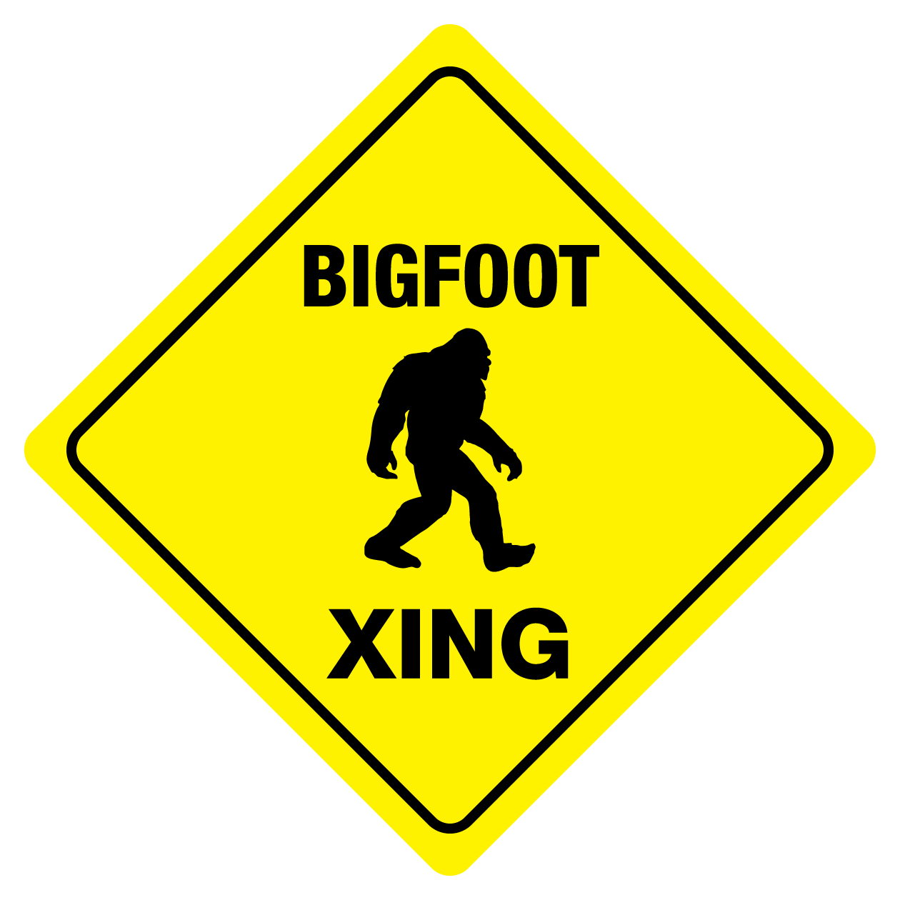

<!--
Comments in HTML are like this! 
-->
```{r, echo=FALSE, message=FALSE, warning=FALSE}
# Set R Markdown chunk defaults:
knitr::opts_chunk$set(
  echo = FALSE, message = FALSE, warning = FALSE, 
  fig.width = 16/2, fig.height = 9/2
)
```


```{r}
# Load all necessary packages here. 
library(tidyverse)
library(leaflet)
library(sf)
library(htmltools)
library(readr)
library(maps)
# Load in datasets
bigfoot_times <- read_csv("~/final_project/bfro_report_locations.csv")
sighting_details <- read_csv("~/final_project/bfro_reports_geocoded.csv")
#Select for the data we need
bigfoot_times <- bigfoot_times %>% select(number, timestamp, classification)
sighting_details <- sighting_details %>% select(-observed,-location_details, -county, - classification, -title)
#Join the datasets based on the "number" labelling them, only include sightings with complete data
bigfoot_data <- inner_join(bigfoot_times, sighting_details, by = "number")
#Filter for only the "Class A" sightings, firsthand views
bigfoot_data <- filter(bigfoot_data, classification == "Class A")
```
{ width=400px }

Okay, so your interest in Bigfoot has piqued. Maybe you just want to know a little more about him. Maybe you want to know his preferences so you can have the highest likelihood of spotting Bigfoot on your next expedition. Maybe you’re a big fan of “Finding Bigfoot” on the Discovery Channel. Maybe you clicked through because you don’t have anything else to do. Whatever the case may be, we have more information for you. Below, we explore more in depth what conditions increase the likelihood of Bigfoot sightings. (Disclaimer: if you are unable to find Bigfoot, we take no responsibility for your failure. Bigfoot is a very peculiar creature and maybe he just doesn’t like you. We are also not responsible for any bodily harm or feelings of profound disappointment that may occur to you on your expeditions. The Bigfoot search should not be taken lightly, and is not for the faint of heart.)


#Temperature
```{r}
#Create a plot showing the midpoint between high and low temperatures the day of the sightings in degrees Fahrenheit to determine bigfoot's favorite temperature
ggplot(data = bigfoot_data, mapping = aes(x = temperature_mid)) +
  geom_histogram(bins=20, fill = "#336600") + 
  ggtitle("Bigfoot's Favorite Temperature") +
  xlab("Temperature of Sighting (˚F)") + 
  ylab("Count")
```

The first thing that we wanted to determine was Bigfoot’s ideal temperature. Based on his hairy anatomy, we initially thought he might prefer cold temperatures, and we wanted to check if our hypothesis was correct. To do this, we gathered all of the sightings of Bigfoot with information on temperature. Then, we created a histogram based on temperature and number of sightings. This revealed a clear pattern in what temperature you were most likely to spot Bigfoot. The highest number of sightings, over 200, occurred at around 70 degrees. Surprisingly, It seems that despite the fact that our friend is covered in fur, he likes to keep it moderate. 

#Humidity
```{r}
#Create a plot showing the relative humidity the day of the sightings to determine bigfoot's favorite climate
ggplot(data = bigfoot_data, mapping = aes(x = humidity)) +
  geom_histogram(bins=15, fill = "#336600") + 
  ggtitle("Bigfoot's Favorite Humidity") +
  xlab("Humidity of Sighting") + 
  ylab("Count")
```

Next, we hunted for his favorite humidity. We put together all of the sightings with data on how humid it was the day bigfoot was spotted, using relative humidity from zero to one. Our graph reveals that bigfoot likes it slightly more on the humid side, tending to come out when it is around .75 relative humidity. Again, this is a bit of a surprise considering his fuzzy nature, but now that you know you will have a leg (or foot) up on the Bigfoot spotting competition. 

#Year

```{r}
#Extract the year from the reported sighting date
bigfoot_year <- mutate(bigfoot_data, year = substr(bigfoot_data$timestamp, 1, 4))
#Check how often bigfoot was seen per year
year_count <- bigfoot_year %>% group_by(year) %>% summarize(count = n())
#Remove years before 1997 so we can look at just the past 20 years and the data doesn't get overwhelming
year_count <- year_count %>% filter(year >= 1997)
#Create a plot showing how active bigfoot has been from year to year, tilt the text so it doesn't overlap
ggplot(data = year_count, mapping = aes(x = factor(year), y=count)) +
  geom_point(color = "#336600") + 
  theme(axis.text.x = element_text(angle = 90, vjust = 0.5)) +
  ggtitle("Bigfoot Sightings by Year") +
  xlab("Year") + 
  ylab("Count")
  
```
The third item that we looked at was the number of reported Class A Bigfoot sightings per year. To do this, we gathered all of the sightings of Bigfoot date information and extracted the year. Then, we created a scatterplot based on year and number of sightings. We reduced the original size of the scatterplot from showing the data from 1890 to today and instead chose to narrow the scope of the data from 1997 onwards so as not to overwhelm the viewer with information. Our graph clearly revealed in what year you were most likely to spot Bigfoot. The peak number of Class A Bigfoot sightings,138, occurred in the year 2004. Unfortunately the overall pattern of sightings seems to be in decline, with a pretty steady decrease especially over the last four years and only 9 sightings in 2017. However, this is no cause for alarm. Do not despair, Bigfoot Seeker! His overall pattern of appearances seems to go up and down fairly frequently when you expand your look at his appearance data way back to the 1890s. Searching for Bigfoot now only means your sighting be more rare and special, and that your friends and family will be even more excited to hear about it.

# Some Big(foot) Conclusions
In summary, if you are looking to increase your chances of spotting Bigfoot, there are a few things that you can do. Head out on a nice 70-degree, .75 relative humidity day, somewhere along our nation’s coastline. Examining our interactive map shows that the greatest density of bigfoot sightings is in the Pacific Northwest, so your best odds would be to begin your mission there. A quick search for weather trends around Washington informs me that the average temperature range there in August is from 57-76˚ and the average humidity is .74. While you’re in Washington in August, you may want to attend the International Bigfoot Conference ^[“International Bigfoot Conference | About.” International Bigfoot Conference | About, www.internationalbigfootconference.com/.]. This year it is August 30th-September 1st in Kennewick, WA. That’s the perfect time to meet fellow Bigfoot enthusiasts and have the best odds of seeing the fuzzy cryptid! 

# Works Cited